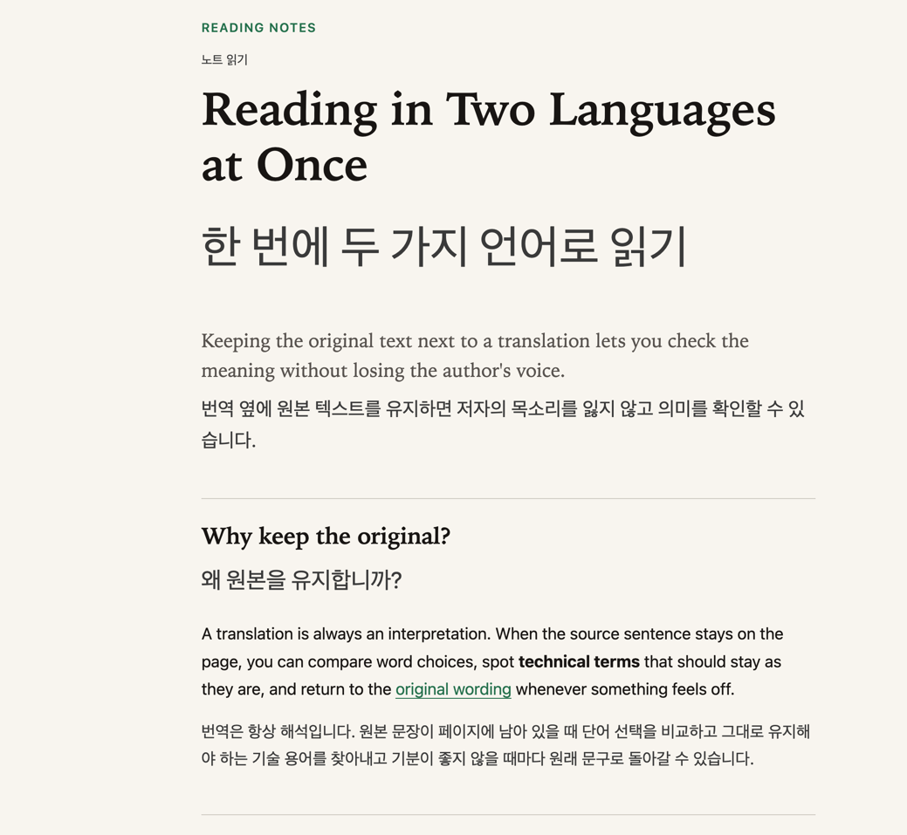

# Inline Translate for Chrome

[](README.md)
[](README.en.md)

영어 원문을 유지하면서 각 제목과 문단 바로 아래에 한국어 번역을 표시하는 Chrome 확장 프로그램입니다.

Chrome 내장 Translator API를 사용하므로 구독, 계정, API 키, 외부 번역 서버가 필요하지 않습니다. 번역 모델은 최초 사용 시 Chrome이 내려받고, 준비가 끝나면 기기에서 번역합니다.



## 주요 기능

- 영어 제목·문단·목록·표 아래에 한국어 번역 표시
- 원문과 동일한 글자 크기 적용
- 진한 회색(`#424242`) 번역문
- 우클릭 메뉴에서 번역 추가·제거 전환
- 번역 중 다시 실행하면 작업 취소 및 번역 제거
- 동일 문단의 번역 중복 방지
- 변경된 문단과 늦게 도착한 번역 응답 차단
- 선택적으로 사이드 패널에서 진행 상태 확인·중지·삭제

## 요구 사항

- Chrome 138 이상
- 데스크톱 Chrome

Translator API와 Language Pack 지원 상태는 Chrome 버전 및 환경에 따라 달라질 수 있습니다.

## 설치

1. 이 저장소를 클론하거나 다운로드합니다.

   ```bash
   git clone https://github.com/<username>/inline-translate-chrome.git
   ```

2. Chrome 주소창에서 `chrome://extensions`를 엽니다.
3. 오른쪽 위의 **개발자 모드**를 켭니다.
4. **압축해제된 확장 프로그램을 로드합니다**를 누릅니다.
5. 이 저장소의 루트 폴더를 선택합니다. `manifest.json`이 바로 보여야 합니다.
6. 확장 프로그램을 수정한 뒤에는 확장 관리 화면에서 새로고침 버튼을 누르고 대상 웹페이지도 새로고침합니다.

개발자 모드로 설치한 뒤에는 저장소 폴더를 이동하거나 삭제하지 마세요.

## 사용법

일반 웹페이지에서 마우스 오른쪽 버튼을 누르고 **번역하기**를 선택합니다.

- 번역이 없는 상태: 한국어 번역을 원문 아래에 추가합니다.
- 번역된 상태: 한국어 번역을 제거합니다.
- 번역 중인 상태: 작업을 취소하고 이미 표시된 번역도 제거합니다.

우클릭 방식은 사이드 패널을 열지 않습니다.

Chrome이 해당 사이트에서 번역 모델을 처음 준비할 때 사용자 클릭을 요구할 수 있습니다. 이 경우 페이지 오른쪽 아래에 나타나는 안내에서 **모델 준비 후 번역**을 한 번 누릅니다.

도구 모음의 **문단 아래 한국어** 아이콘을 누르면 선택적으로 사이드 패널을 열 수 있습니다. 사이드 패널에서는 번역 진행 상태 확인, 중지, 번역 제거 기능을 사용할 수 있습니다.

## 지원 범위

다음 텍스트 블록을 처리합니다.

- 제목 `h1`–`h6`
- 문단
- 목록 항목
- 표 셀과 헤더
- 인용문과 캡션
- 일반 컨테이너의 직접 텍스트

다음 내용은 처리하지 않습니다.

- 코드와 미리 서식화된 텍스트
- 입력·편집 영역
- 내비게이션 영역과 숨겨진 내용
- `translate="no"` 영역
- 이미지 속 글자
- PDF
- iframe 내부 콘텐츠
- Shadow DOM 내부 콘텐츠
- Chrome 내부 페이지와 Chrome 웹 스토어

영어로 판단되는 텍스트만 번역합니다. 라틴 문자가 많은 다른 언어가 영어로 인식될 수 있으며, 페이지 구조에 따라 문단 분리와 번역 위치가 달라질 수 있습니다. 한 번에 최대 2,000개 텍스트 블록을 처리합니다.

## 개인정보 및 권한

확장 프로그램은 모든 사이트에 대한 상시 접근 권한을 요구하지 않습니다.

| 권한 | 용도 |
|---|---|
| `activeTab` | 사용자가 실행한 현재 탭에 임시로 접근 |
| `scripting` | 본문을 읽고 번역문을 삽입 |
| `contextMenus` | 우클릭 메뉴에 **번역하기** 추가 |
| `sidePanel` | 선택적 번역 제어 패널 표시 |

외부 번역 서버, 분석 SDK, 원격 실행 코드는 포함하지 않습니다. 원문과 번역 캐시는 현재 페이지 또는 열린 패널의 메모리에만 유지합니다. 언어 모델 다운로드와 실행은 Chrome이 관리합니다.

## 참고 문서

- [Chrome Translator API](https://developer.chrome.com/docs/ai/translator-api)
- [Built-in AI APIs](https://developer.chrome.com/docs/ai/built-in-apis)
- [activeTab 권한](https://developer.chrome.com/docs/extensions/develop/concepts/activeTab)
- [contextMenus API](https://developer.chrome.com/docs/extensions/reference/api/contextMenus)
- [sidePanel API](https://developer.chrome.com/docs/extensions/reference/api/sidePanel)
